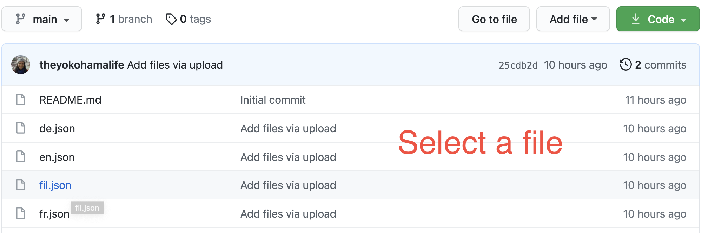
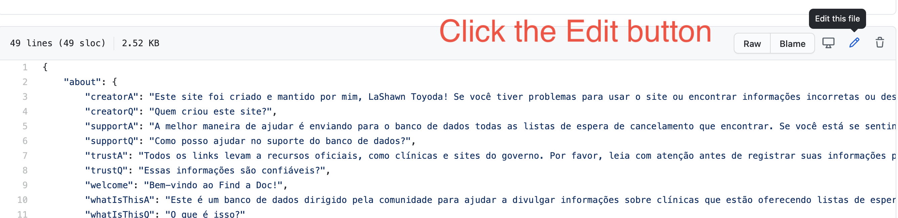
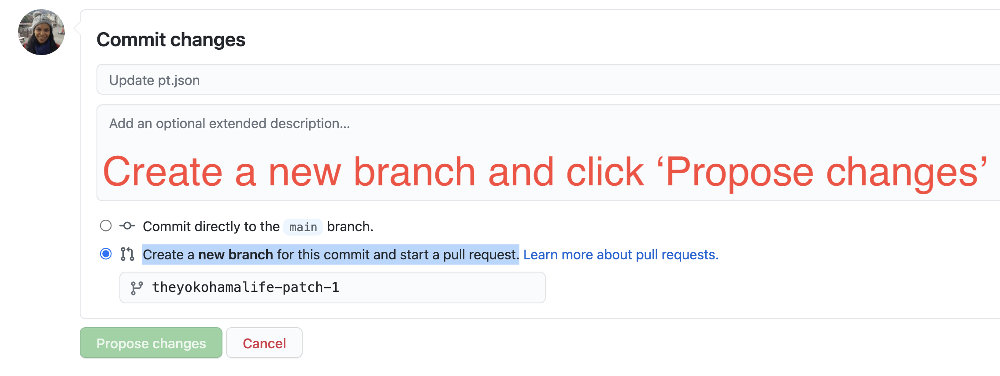
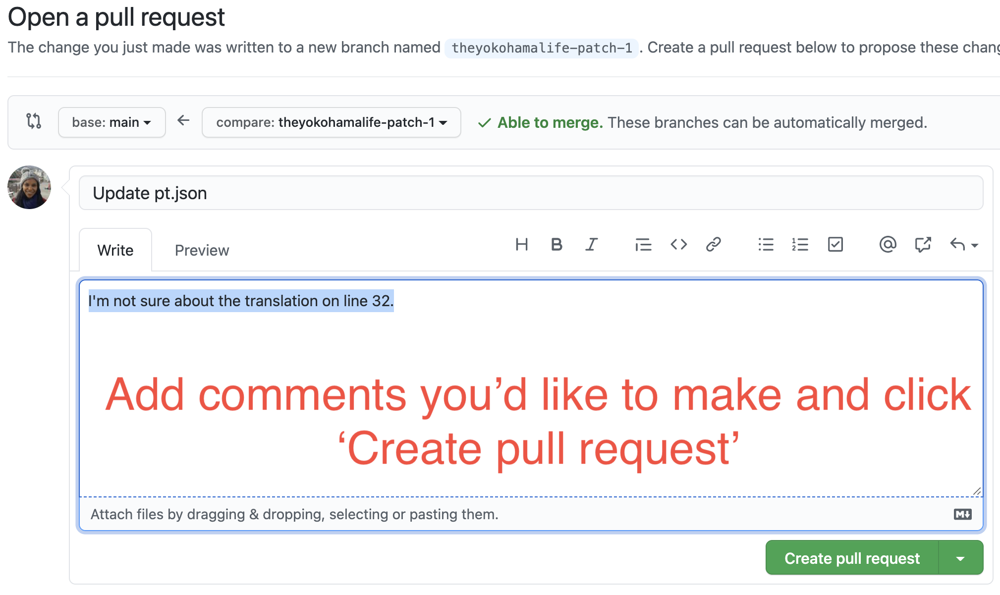

# Find a Doc - Localization

[Find a Doc](https://findadoc.jp) is a free online resource aimed at helping connect the foreign community in Japan with health services in their native language.

Translations are initially created by machine in a special file format, and then edited by volunteers to be published on the site.

## How to Contribute

If you speak a foreign language and can help translate files, Go to 👉️ [Translator Guide](#translator-guide)

If are a developer trying to add internationalization (i18n) keys, Go to 👉️ [Developer Guide](#developer-guide)


## Translator Guide

The easiest and fastest way to contribute is through Git. Simply **clone this repo and open a PR to merge your changes**.

If you're new to Git, here are some easy steps you can take to get started:

### Beginner Git

1. Go into the [locales](https://github.com/ourjapanlife/findadoc-localization/tree/main/locales) folder and click on the language file you wish to contribute to. It will take you to a screen that will show you its content. (Note if you are creating a new language file, copy from `en.json` and please name the new file using the two-letter language codes defined [here](https://en.wikipedia.org/wiki/List_of_ISO_639-1_codes))
   

2. Click the `edit` button so you can directly edit the translation through your browser. **Use the `en.json` file and the [website](https://findadoc.jp) as the reference content.**
   
   
   
_Make sure to only edit the part inside of the quotation marks of your selected language._

You might notice the files are in a special format so the computer can read it. This format is called JSON (JavaScript Object Notation) and contains
a key on the left side, and a value on the right side. Notice that the key names are in English, and sometimes the letters are squished together like this `noSpacesHere`. Please only edit the values, not the keys. Note the example below has a key of "vaccine" and a value translated into Japanese.
```json
{
   "key": "value",
   "vaccine": "ワクシン"
}
```

If this is confusing or you get stuck, we are here to help. See contact information below 😊

3. Select the `Create a new branch for this commit and start a pull request` option at the bottom of the page. Then click the `Propose changes` button.
   

4. Optional - Add any comments you want to make on the pull request screen.
   

5. Click the `Create pull request` button.

Thank you! Your changes will be reviewed!

_If you have any trouble with this document, please file an issue or reach out to [@stonecoldkilzer on Twitter](https://twitter.com/stonecoldkilzer)_

## Developer Guide

1. Fork & clone this repo to your computer
2. Edit the `locales/en.json` to contain the new keys.
3. If you know another language, feel free to add the same key and translation to the appropriate locale file. Omit if you don't know it; we use English as the [fallback language](https://kazupon.github.io/vue-i18n/guide/fallback.html) so nothing will break.
4. Make a pull request in this repo and wait for it to be merged to `main`
5. Make your change in the sourcecode with the new i18n keys and submit your PR 🎉
