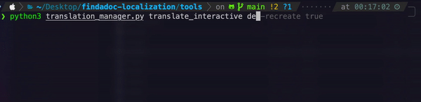

# Translation Manager

If you are familiar with the command line, you might consider using the interactive translation manager for a much faster translation process! ⚡️


## How to use it

Run the following command inside this folder to spawn an interactive translation shell:

```bash
python translation_manager.py translate_interactive <TARGET_LANGUAGE>
```

You will be asked to submit the missing translation keys.
Replace `<TARGET_LANGUAGE>` with the language you want to translate to.
The provided language must be a [short letter code](https://en.wikipedia.org/wiki/List_of_ISO_639-1_codes) (ISO 639-1).

> Note: If you want to enforce recreating all keys, pass the flag `-recreate` to the end of the above command.  
This might be useful if you want to proof-check keys, as it also shows you the English source sentence alongside the current translation. Translations that you consider good can be simply inherited when you leave the prompt empty.
